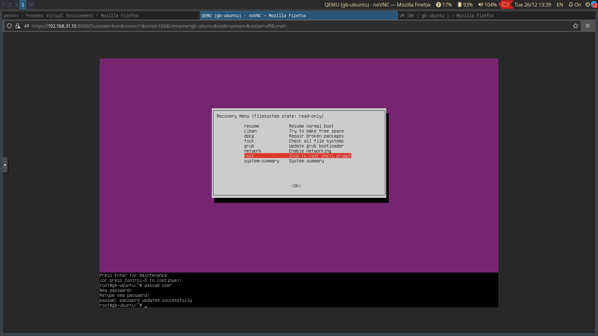
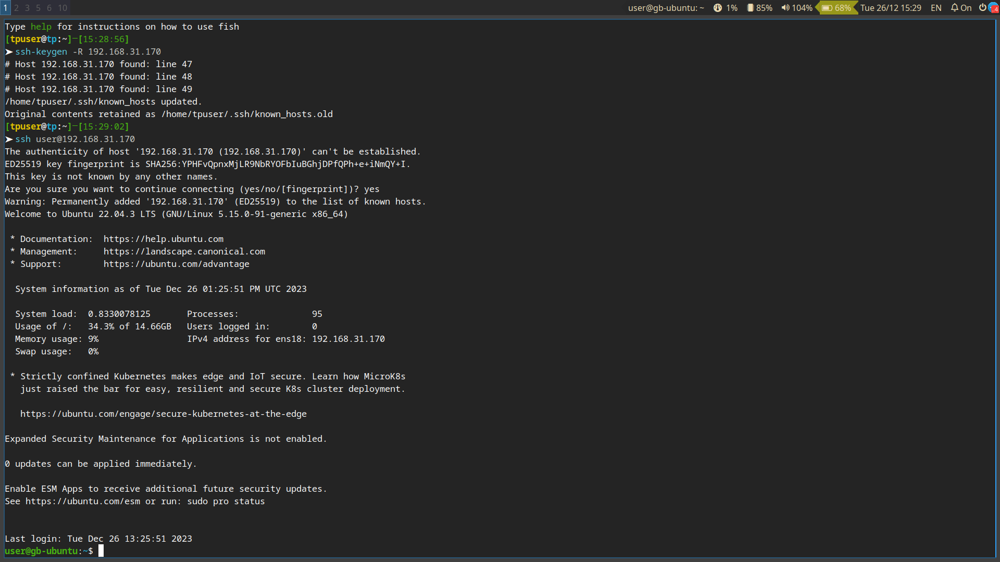

# Домашнее задание к семинару 1

## Задание 1

### Условие

Используем режим восстановления. Первый способ. Подключаем корневую файловую систему в режиме r/w, меняем пароль через passwd. Второй способ. Загружаем систему в режиме single (параметр ядра), меняем пароль, перезагружаемся.

### Решение




## Задание 2

### Условие

Устанавливаем систему с опцией конфигурации “Включить EFI” в VirtualBox. Загружаемся в режим LiveCD. Удаляем файлы из /boot/efi. Монтируем корневую файловую систему и псевдофайловые системы (включая /boot/efi). Устанавливаем загрузчик на диск. Проверяем запуск системы.

_Примечание:_ система стоит в proxmox, опция EFI выбрана.

### Решение




#### Последовательность команд для восстановления


```bash 

# смонтируем корень(поскольку при установке выбирался lvm, то и монтруем именно логический том)
mount /dev/ubuntu-vg/ubuntu-lv /mnt

# смонтируем раздел /boot 
mount /dev/sda2 /mnt/boot

# смонтируем efi раздел
mount /dev/sda1 /mnt/boot/efi

# прокинем блочные устройства
for i in /dev /dev/pts /proc /run /sys; do mount -B $i /mnt$i; done

# меняем корень ОС
chroot /mnt

# монтируем заглушку для настроек UEFI. Зачем не знаю, но installer после этого warning не выплевывает 
mount -t efivarsfs none /sys/firmware/efi/efivars

# устанавливаем grub
grub-install /dev/sda

# генерируем настройки и ram диск
update-grub2

# выходим в корень Live-системы
exit

# рекурсивно отмонтируем подключенные устройства
umount -R /mnt

# перезагружаемся
reboot
```
