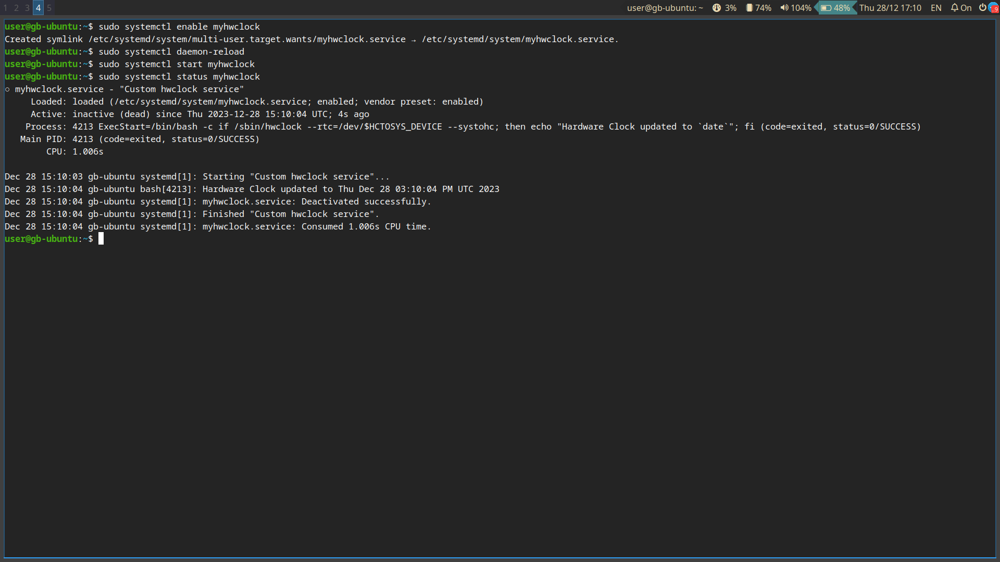

# Урок 2. Процессы, systemd

## Задание 1. 

### Условие 

Создайте systemd сервис для вашей системы. За основу можно взять init-скрипт и перевести его в формат юнита .service. Добавьте юнит в автозагрузку.

### Решение

Исходный файл службы
```bash
#!/bin/sh

### BEGIN INIT INFO
# Provides:          hwclock
# Required-Start:
# Required-Stop:     mountdevsubfs
# Should-Stop:       umountfs
# Default-Start:     S
# Default-Stop:      0 6
# Short-Description: Save system clock to hardware on shutdown.
### END INIT INFO

# Note: this init script and related code is only useful if you
# run a sysvinit system, without NTP synchronization.

if [ -e /run/systemd/system ] ; then
    exit 0
fi

unset TZ

hwclocksh()
{
    HCTOSYS_DEVICE=rtc0
    [ ! -x /sbin/hwclock ] && return 0
    [ ! -r /etc/default/rcS ] || . /etc/default/rcS
    [ ! -r /etc/default/hwclock ] || . /etc/default/hwclock

    . /lib/lsb/init-functions
    verbose_log_action_msg() { [ "$VERBOSE" = no ] || log_action_msg "$@"; }

    case "$1" in
        start)
            # start is handled by /usr/lib/udev/rules.d/85-hwclock.rules.
            return 0
            ;;
        stop|restart|reload|force-reload)
            # Updates the Hardware Clock with the System Clock time.
            # This will *override* any changes made to the Hardware Clock,
            # for example by the Linux kernel when NTP is in use.
            log_action_msg "Saving the system clock to /dev/$HCTOSYS_DEVICE"
            if /sbin/hwclock --rtc=/dev/$HCTOSYS_DEVICE --systohc; then
                verbose_log_action_msg "Hardware Clock updated to `date`"
            fi
            ;;
        show)
            /sbin/hwclock --rtc=/dev/$HCTOSYS_DEVICE --show
            ;;
        *)
            log_success_msg "Usage: hwclock.sh {stop|reload|force-reload|show}"
            log_success_msg "       stop and reload set hardware (RTC) clock from kernel (system) clock"
            return 1
            ;;
    esac
}

hwclocksh "$@"
``` 

Итоговый файл службы
```ini
[Unit]
Description="Custom hwclock service"

[Service]
Environment="HCTOSYS_DEVICE=rtc0"
ExecStart=/bin/bash -c 'if /sbin/hwclock --rtc=/dev/$HCTOSYS_DEVICE --systohc; then echo \"Hardware Clock updated to `date`\"; fi'
Type=oneshot

``` 
[Сам файл](./myhwclock.service)

Скрин запуска


## Задание 2. 

### Условие

Установите пакет apache2. Дополните конфигурацию сервиса, не меняя основной файл юнита настройкой: PrivateTmp=no.


### Решение

#### Установка пакета
```bash

user@gb-ubuntu:~$ sudo apt install apache2
...
Created symlink /etc/systemd/system/multi-user.target.wants/apache2.service → /lib/systemd/system/apache2.service.
Created symlink /etc/systemd/system/multi-user.target.wants/apache-htcacheclean.service → /lib/systemd/system/apache-htcacheclean.service.
Processing triggers for ufw (0.36.1-4ubuntu0.1) ...
...
user@gb-ubuntu:~$
```

#### Дополнение конфигурации
```bash
user@gb-ubuntu:~$ sudo systemctl edit apache2
[sudo] password for user: 
user@gb-ubuntu:~$ sudo systemctl daemon-reload 
user@gb-ubuntu:~$ sudo systemctl status apache2
● apache2.service - The Apache HTTP Server
     Loaded: loaded (/lib/systemd/system/apache2.service; enabled; vendor preset: enabled)
    Drop-In: /etc/systemd/system/apache2.service.d
             └─override.conf
     Active: active (running) since Thu 2023-12-28 15:15:04 UTC; 11min ago
       Docs: https://httpd.apache.org/docs/2.4/
   Main PID: 4788 (apache2)
      Tasks: 55 (limit: 2213)
     Memory: 4.8M
        CPU: 62ms
     CGroup: /system.slice/apache2.service
             ├─4788 /usr/sbin/apache2 -k start
             ├─4790 /usr/sbin/apache2 -k start
             └─4791 /usr/sbin/apache2 -k start

Dec 28 15:15:04 gb-ubuntu systemd[1]: Starting The Apache HTTP Server...
Dec 28 15:15:04 gb-ubuntu apachectl[4787]: AH00558: apache2: Could not reliably determine the server's fully qualified domain name, using 127.0.1.1. Set the 'ServerName' directive globally >
Dec 28 15:15:04 gb-ubuntu systemd[1]: Started The Apache HTTP Server.
user@gb-ubuntu:~$ sudo systemctl restart apache2
user@gb-ubuntu:~$ sudo systemctl status apache2
● apache2.service - The Apache HTTP Server
     Loaded: loaded (/lib/systemd/system/apache2.service; enabled; vendor preset: enabled)
    Drop-In: /etc/systemd/system/apache2.service.d
             └─override.conf
     Active: active (running) since Thu 2023-12-28 15:27:30 UTC; 2s ago
       Docs: https://httpd.apache.org/docs/2.4/
    Process: 5286 ExecStart=/usr/sbin/apachectl start (code=exited, status=0/SUCCESS)
   Main PID: 5291 (apache2)
      Tasks: 55 (limit: 2213)
     Memory: 4.7M
        CPU: 25ms
     CGroup: /system.slice/apache2.service
             ├─5291 /usr/sbin/apache2 -k start
             ├─5292 /usr/sbin/apache2 -k start
             └─5293 /usr/sbin/apache2 -k start

Dec 28 15:27:30 gb-ubuntu systemd[1]: apache2.service: Deactivated successfully.
Dec 28 15:27:30 gb-ubuntu systemd[1]: Stopped The Apache HTTP Server.
Dec 28 15:27:30 gb-ubuntu systemd[1]: Starting The Apache HTTP Server...
Dec 28 15:27:30 gb-ubuntu apachectl[5289]: AH00558: apache2: Could not reliably determine the server's fully qualified domain name, using 127.0.1.1. Set the 'ServerName' directive globally >
Dec 28 15:27:30 gb-ubuntu systemd[1]: Started The Apache HTTP Server.

```

Содержимое /etc/systemd/system/apache2.service.d/override.conf

```ini
[Service]
PrivateTmp=0
```


## Задание 3. 

### Условие

Найдите с помощью journalctl все успешные и неуспешные попытки подключения по SSH под вашим пользователем за сегодня, посчитайте количество этих попыток отдельно по типам.

### Решение
