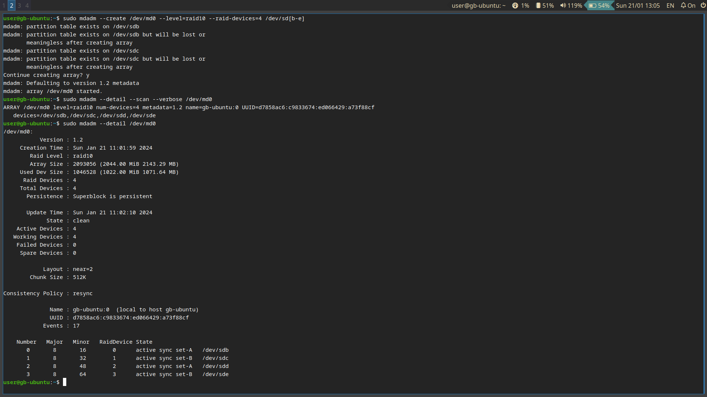
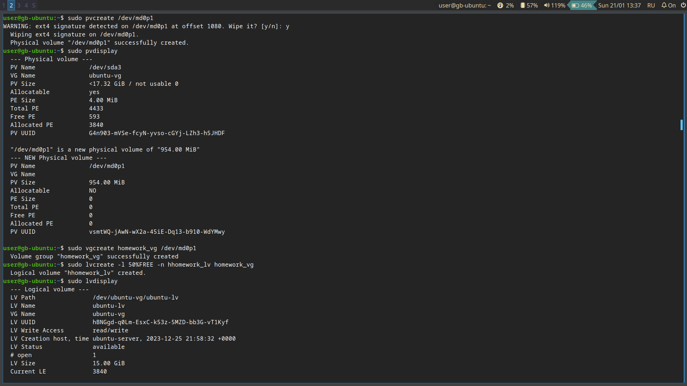
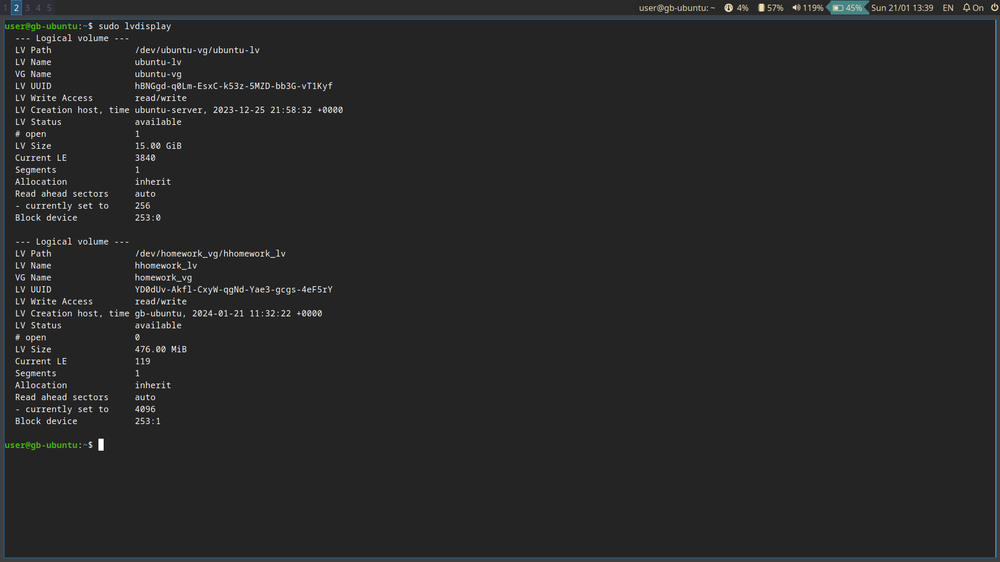
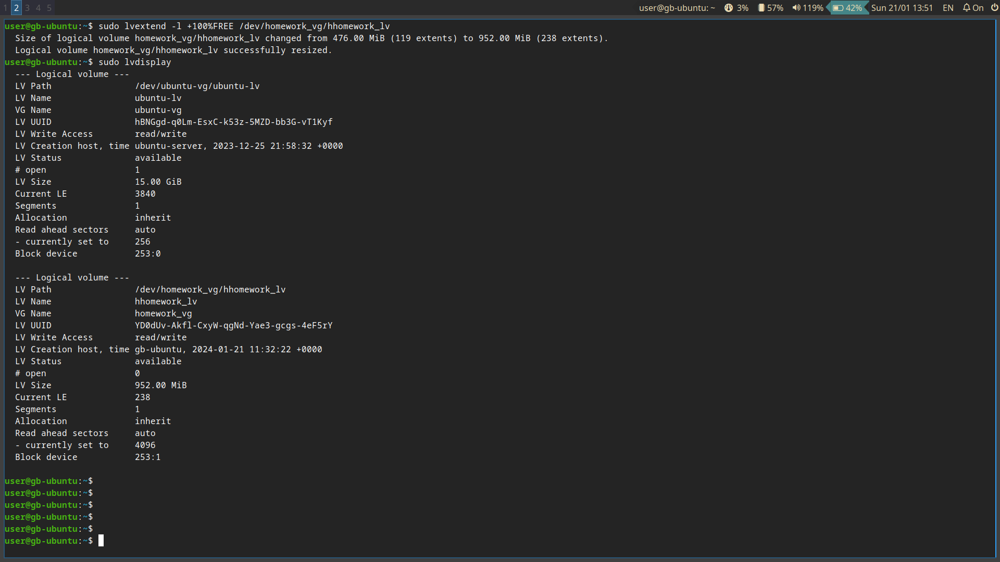
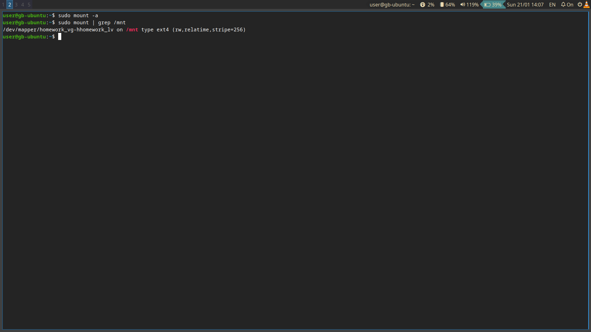
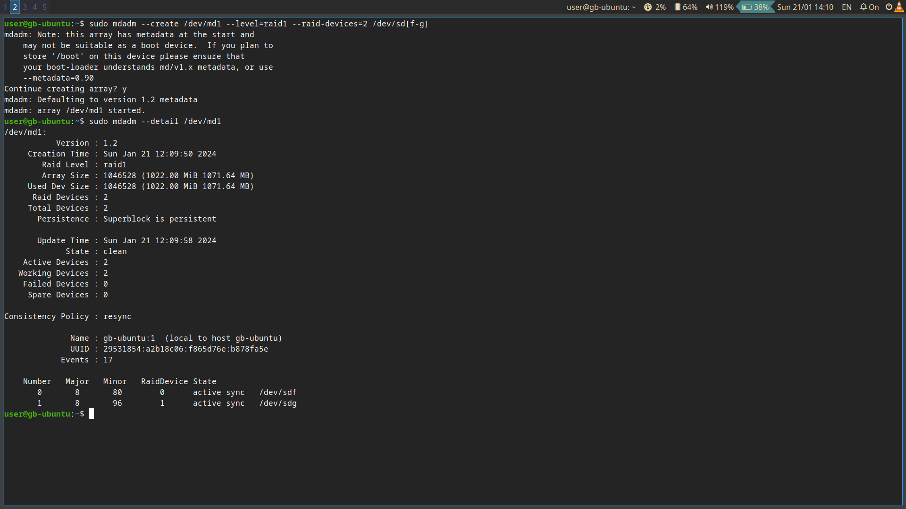
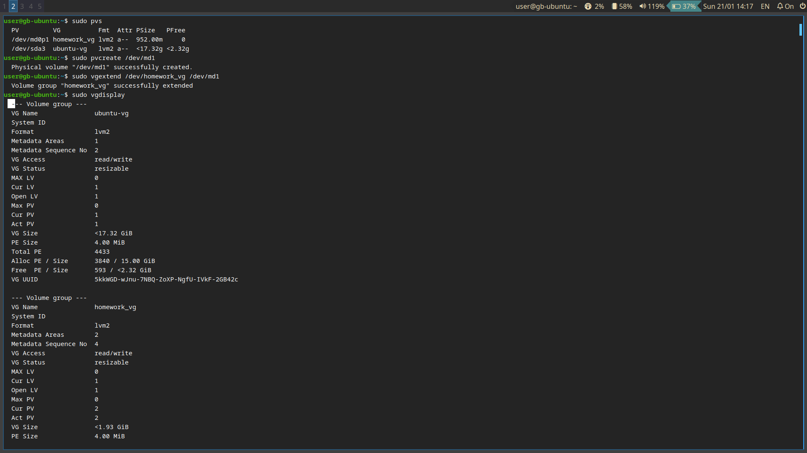
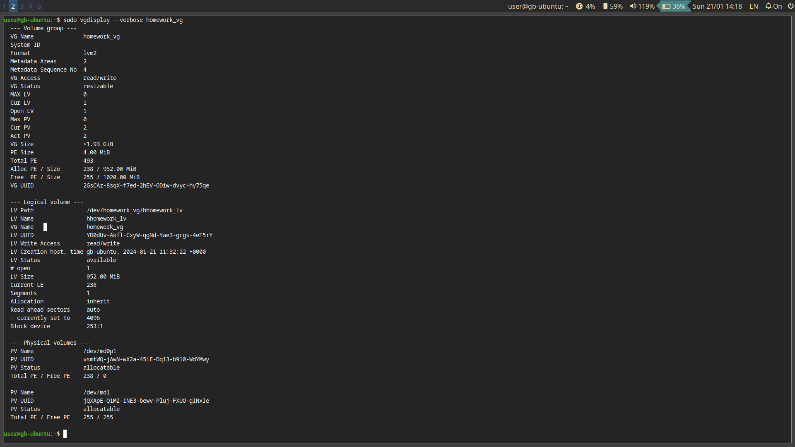

# Урок 3. Диски LVM, RAID

## Задание 1.

### Условие 
Создайте RAID-массив 10 уровня из 4 дисков.

### Решение

```bash
sudo mdadm --create /dev/md0 --level=raid10 --raid-devices=4 /dev/sd[b-e]
# Удостоверимся, что все создалось корректно
sudo mdadm --detail --scan --verbose /dev/md0
# Дождемся пока соберется RAID
sudo mdadm --detail /dev/md0
```


## Задание 2.

### Условие 
Поверх массива создайте LV размером 50% доступного места.

### Решение
```bash
# Создадим физический раздел 
sudo pvcreate /dev/md0p1
# Проверим корректность создания
sudo pvdisplay
# Создадим логическую группу дисков
sudo vgcreate homework_vg /dev/md0p1
# Проверим корректность создания
sudo vgdisplay
# Создадим логический диск размером 50% доступного места
sudo lvcreate -l 50%FREE -n hhomework_lv homework_vg
# Проверим корректность создания
sudo lvdisplay
```



## Задание 3.

### Условие
Увеличьте размер LV до 100% доступного места. Добавьте раздел в /etc/fstab.

### Решение
```bash
sudo lvextend -l +100%FREE /dev/homework_vg/hhomework_lv 
# Убедимся, что все создалось, узнаем UUID
sudo lvdisplay
# Отредактируем fstab, затем убедимся в корректности
sudo mount -a
sudo mount | grep /mnt  
```




## Задание 4.

### Условие
Создайте еще один RAID-массив 1 уровня из 2 дисков.

### Решение
```bash
sudo mdadm --create /dev/md1 --level=raid1 --raid-devices=2 /dev/sd[f-g]
sudo mdadm --detail /dev/md1
```




## Задание 5.

### Условие
Увеличьте размер используемой VG за счет нового RAID-массива.

### Решение
```bash
# Создаем физический том
sudo pvs
sudo pvcreate /dev/md1
# Расширяем homework_vg за его счет
sudo vgextend /dev/homework_vg /dev/md1

sudo vgdisplay
# Проверяем, что все коректно
sudo vgdisplay --verbose homework_vg
```




