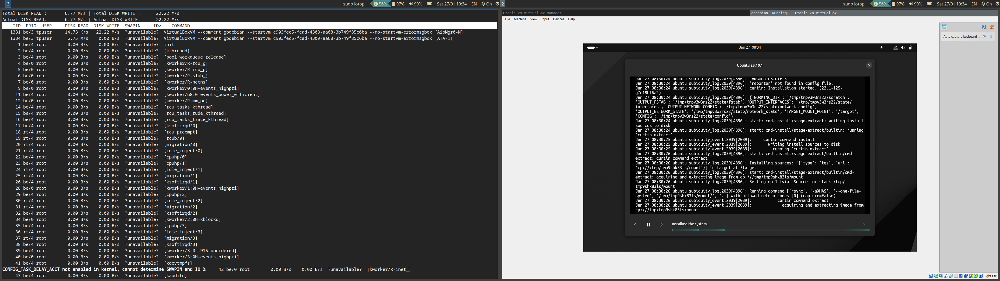
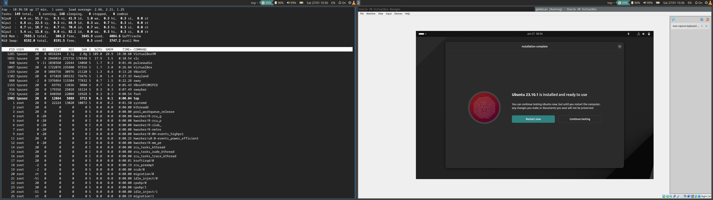
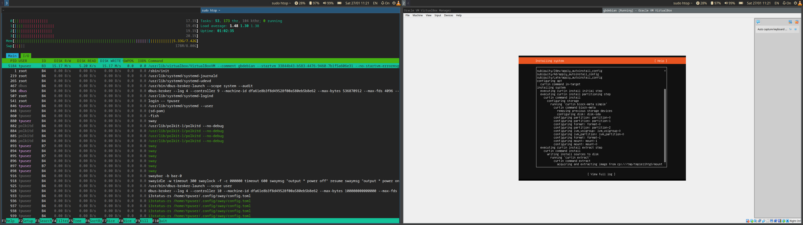
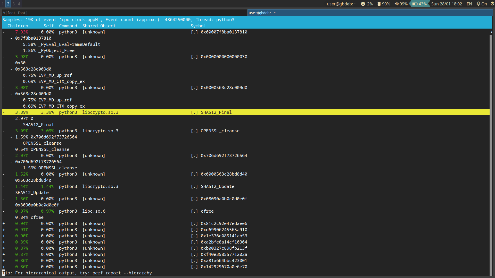

# Задания

## Задание 1. 

### Условие
Создайте нагрузку на систему любым удобным для вас способом.

### Решение
Нагрузка создана установкой ОС в виртуальной машине.


## Задание 2.

### Условие
Проведите анализ использования ресурсов несколькими утилитами.

### Решение
- Использование ресурсов ввода-вывода в утилите ```iotop```



- Использование ресурсов cpu в утилите ```top```



- Использование ресурсов ввода-вывода в утилите ```htop```




## Задание 3.

### Условие
Снимите профиль системы с помощью perf. Найдите самые нагруженные участки кода.

### Решение
Нагрузка создается запуском [Flask-приложения](https://github.com/dgeny/linux-troubleshooting/blob/main/seminar-4/app.py).
При вызове функции hard производится взятие 5млн. раз sha384. 
При вызове функции loop приложение уходит в бесконечный цикл.
Команда запуска:
```bash
sudo perf report -g -o hard.perf python -m flask run --host 0.0.0.0  --port 80
```

Результаты мониторинга: 
Самые нагруженные участки кода при вызове ```функций хэширования``` и библиотеки ```openssl```



Запись отчета прилагается в [файле](https://github.com/dgeny/linux-troubleshooting/blob/main/seminar-4/hard.prof)