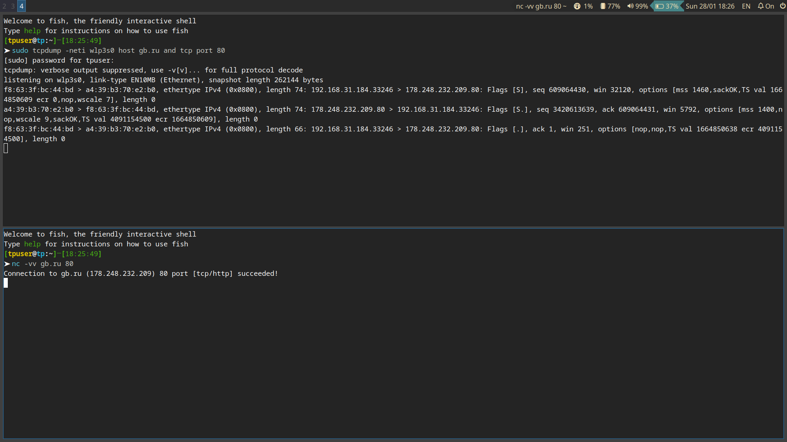
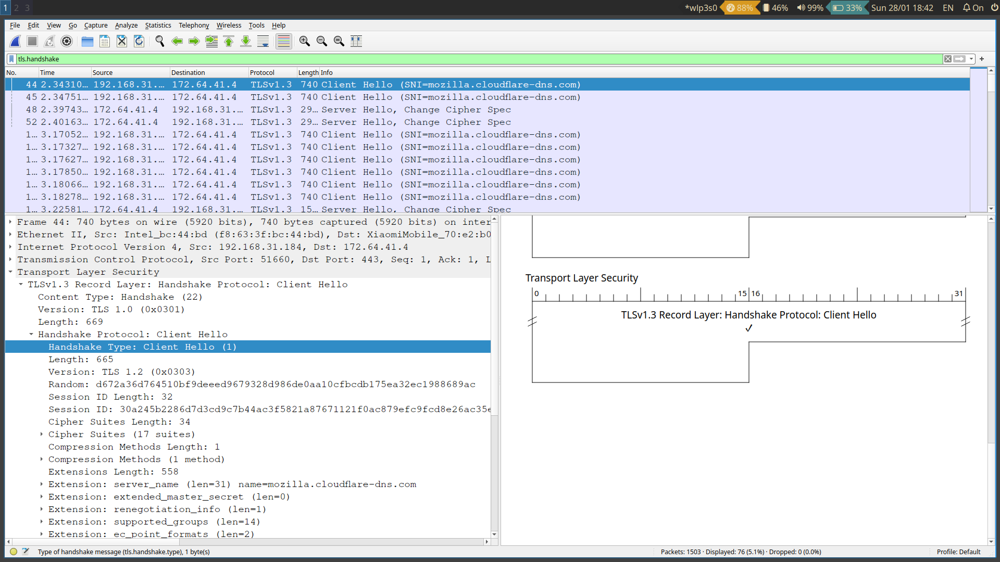

# Задания

## Задание 1. 

### Условие
Составьте команду для захвата трафика с указанного адреса по 80 порту. Проверьте работу команды.

### Решение
```bash
sudo tcpdump -neti wlp3s0 host gb.ru and tcp port 80
```



## Задание 2. 

### Условие
Получите дамп начала сессии работы с HTTPS-ресурсом. Проанализируйте дамп и выделите пакеты, относящиеся к TLS-handshake.

### Решение
Прменяемый фильтр ```tls.handshake```




## Задание 2. 

### Условие
Настройте типичную конфигурацию сетевого фильтра для сервера, имеющего сервисы, доступные извне: TCP 80, 22, 443, UDP 443. Также откройте доступ к сервису MySQL из сети 192.168.0.0/24. Обеспечьте их загрузку при старте системы.

### Решение
```bash
sudo nft add table ip filter
sudo nft 'add chain ip filter input { type filter hook input priority 0 ; }'
sudo nft 'add rule ip filter input iifname "lo" accept'
sudo nft add rule ip filter input tcp dport 22 counter accept
sudo nft add rule ip filter input tcp dport { http,https } counter accept
sudo nft add rule ip filter input ip saddr 192.168.0.0/24 tcp dport 3306 counter accept
sudo nft add rule ip filter input udp dport 443 counter accept
sudo nft add rule ip filter input ct state established,related accept
sudo nft add rule ip filter input ct state invalid drop
sudo nft add chain ip filter input '{ policy drop; }'
sudo nft list ruleset > nftables.conf
# правим файл, добавляем в начало 'flush ruleset' для очистки правил при старте системы
# заменяем файл правил сервиса по умолчанию
sudo cp nftables.conf /etc/
# обеспечиваем автозагрузку
sudo systemctl enable nftables
sudo systemctl start nftables 
```
