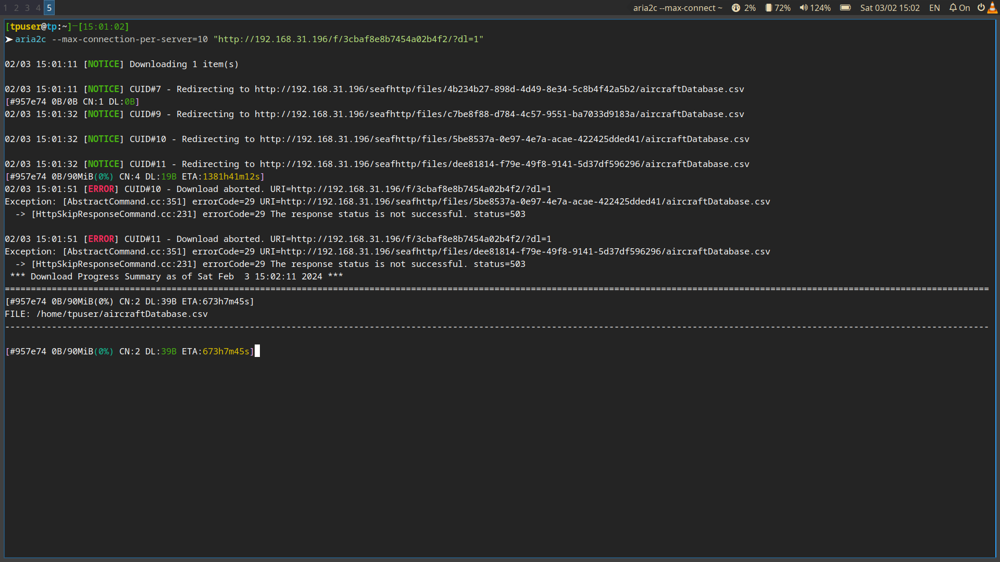
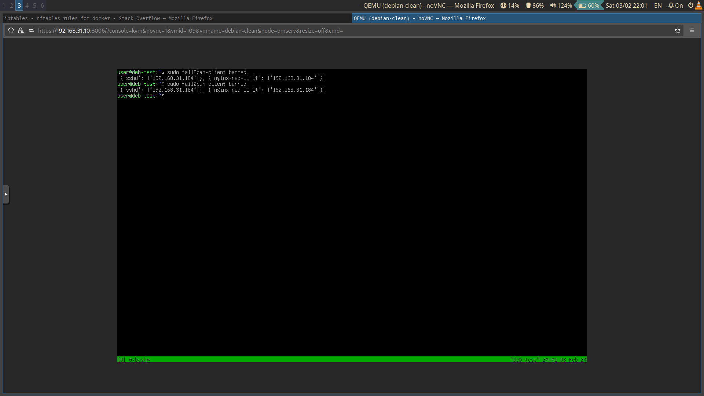

# Задания

## Задание 1. 

### Условие
Настройте веб-сервер Nginx для защиты от базовых DoS-атак. Обоснуйте настройки возможными вариантами атак.

### Решение

В качестве приложения от защиты базовых атак выбран файловый сервис ["Seafile"](https://www.seafile.com/en/home/). Основные векторы DoS-атак:
- открытие множества соединений
- создание нагрузки путем множественной загрузки большого файла
- "бомбардировка запросами"


1. Ограничим время "висящих" соединений, зададим зоны ограничений по количеству запросов и оодновременных соединений.

В секцию http конфигурационнного файла nginx.conf добавляем строки
```ini
    send_timeout 10;
    client_body_timeout 10;
    client_header_timeout 10;
    proxy_connect_timeout 5;
    proxy_send_timeout 10;
    proxy_read_timeout 10;

    limit_req_zone $binary_remote_addr zone=ldyn:10m rate=5r/s;
    limit_req_zone $binary_remote_addr zone=lst:10m rate=10r/s;
    limit_conn_zone $binary_remote_addr zone=lconn:10m;
```
2. Ограничим количество запросов в секунду от 1 клиента

В секцию "location /" конфигурационнного файла сайта добавляем строки
```ini
   limit_req zone=ldyn burst=3 nodelay;
```

3. Ограничим количество потоков зарузки и скорость отдачи для них(2 потока, 20 байт/сек на соединение)
В секцию "location /seafhttp" (отвечает за прямую отдачу файла) конфигурационнного файла сайта добавляем строки
```ini
    limit_rate 20;
	limit_conn lconn 2;
```

Проверки:
1. С помощью утилиты siege (выбрано для наглядности) создадим множество параллельных запросов, превышающих пределы limit_rate
        siege -b -r 5 -c 5 "http://192.168.31.196/"


2. С помощью утилиты aria2c скачаем большой файл, задав количество соединений превышающее установленный limit_conn



## Задание 2. 

### Условие    
Настройте аутентификацию по ключам для SSH между вашей хостовой системой и виртуальной машиной для нескольких пользователей в ВМ. Используйте различные ключи для каждого пользователя.

### Решение
1. Добавим пользоваетелей в систему командой `useradd -m -p <encrypt_password> user1`

2. Для каждого сгенерируем собственный ключ для соединения `for i in $(seq 1 5);do ssh-keygen -b 2048 -t rsa -f ./sshkey$i -q -N "";done;`:


3. Добавим публичный ключ каждому пользователю утлитой `ssh-copy-id`:


4. Проверим командой whoami:


## Задание 3. 

### Условие
Настройте автоматическое добавление в бан пользователей c помощью fail2ban для SSH и по частоте запросов в Nginx.

### Решение

1. Включаем опции sshd 

```ini
SyslogFacility AUTH
LogLevel INFO
MaxAuthTries 6
```

2. Делаем копию /etc/fail2ban/jail.conf  в /etc/fail2ban/jail.local

3. Добавляем в конец строки
```ini
[sshd]
port    = ssh
logpath = %(sshd_log)s
backend = systemd

[nginx-req-limit]
enabled = true
failregex = limiting requests, .*client: <HOST>
port    = http,https
# путь к логу NGINX для сайта, в котором выставлен limit_req
logpath = /opt/seafile-data/logs/var-log/nginx/seahub.error.log
findtime = 600
bantime = 7200
maxretry = 10
```

4. Перезапускаем fail2ban

5. Проверяем как в задании 1 на  ограничение запросов

6. Неправильно вводим 7 раз пароль в ssh 

7. Проверяем


