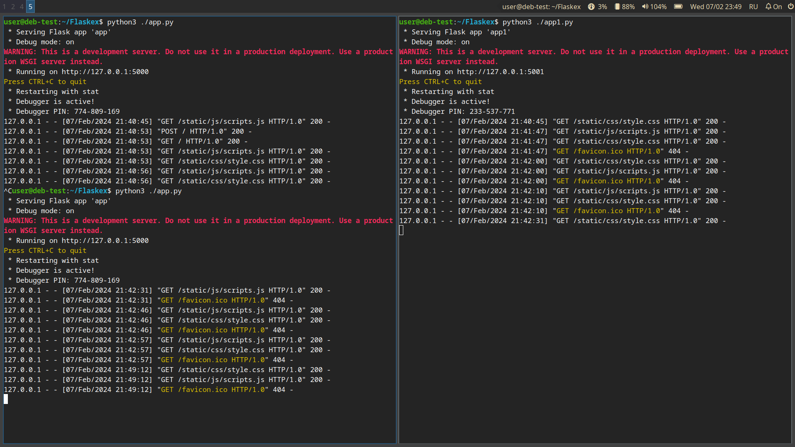
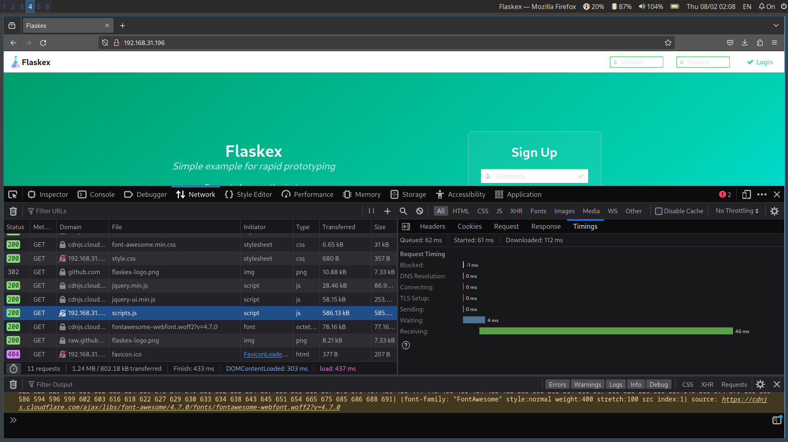
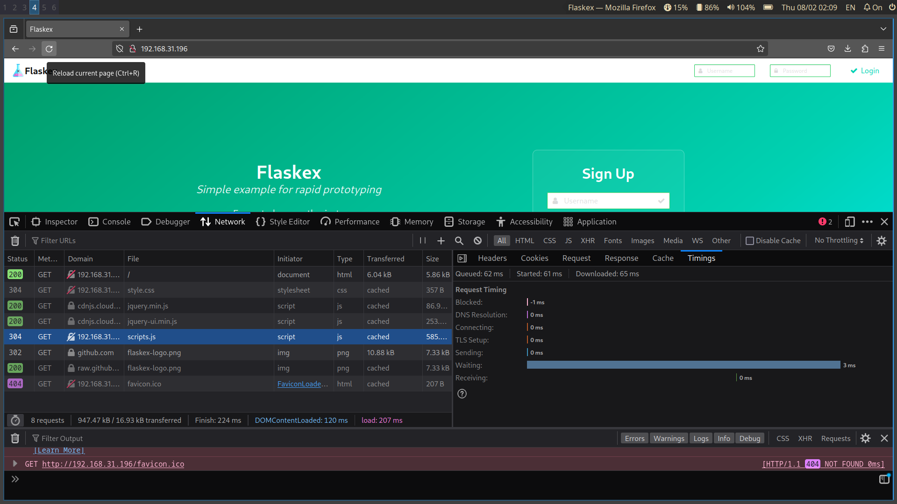

# Задания

## Задание 1. 

### Условие
Настройте Nginx для балансировки нескольких бэкендов. Продемонстрируйте работу нескольких вариантов распределения нагрузки.

### Решение

В качестве приложения для демонстрации балансировки выбран [шаблон](https://github.com/anfederico/flaskex) базового приложения 
Web фреймворка Flask.

Настройки Nginx для обеспечения резервирования (балансировки) :

```ini

upstream backend {
    server 127.0.0.1:5000 weight=1;
    server 127.0.0.1:5001 weight=1 балансировка обеспечена в режиме ;
}

server {
    listen 80;
    listen [::]:80;
    server_name _;
    access_log /var/log/nginx/load-balancer.access;
    error_log /var/log/nginx/load-balancer.error;

    root /var/www/html;
    
    location / {
        proxy_pass http://backend;
        proxy_cache one;
        proxy_cache_valid 200 10m;
        proxy_cache_lock on;
        proxy_cache_use_stale updating error http_500 http_502;
        proxy_cache_background_update on;
    
        allow all;
        log_not_found off;
        access_log off;
    }

    location /static.*$ {
        proxy_cache one;
        proxy_cache_valid 200 1h;
        proxy_cache_lock on;
        proxy_cache_use_stale updating error http_500 http_502;
        proxy_cache_background_update on;

    	add_header Cache-Control "max-age=31536000, public, no-transform, immutable";	
    }   
}

```
Демонстрация:

1. Видно, что 1 экземпляр бэкенда (на порту 5000) аварийно завершил работу в 21:40:57 и возобновил в 21:42:31. 
В это время запросы обрабатывал 2 экземпляр бэкенда (на порту 5001).



2. 



## Задание 2. 

### Условие    
Внедрите настройки для клиентской оптимизации веб-приложения. Обоснуйте выбор настроек.

### Решение


1. Включаем статическое сжатие в секции location /static.*$ файла конфинурации приложения. Все находящиеся там файлы архивируем 
командой `gzip -k ./*` 

## Задание 3. 

### Условие
Реализуйте схему серверного кэширования. Протестируйте влияние кэша на время ответа и пропускную способность сервера. Какие еще меры по серверной оптимизации можно реализовать? Приведите настройки и обоснование.

### Решение

включаем кэширование в файле настроек nginx.conf, определяем зоны кэширования:
```ini
proxy_cache_valid 1m;
proxy_cache_key $scheme$host$request_uri;
proxy_cache_path /tmp/nginx levels=1:2 keys_zone=one:10m inactive=48h max_size=1024m; 
```

включаем кэширование в в секции location /static файла конфигурации приложения:

```ini
add_header Cache-Control "max-age=31536000, public, no-transform, immutable";
```

До включения кэширования:


После:


Время загрузки на "тяжелом" скрипте снизилось в 10 раз.