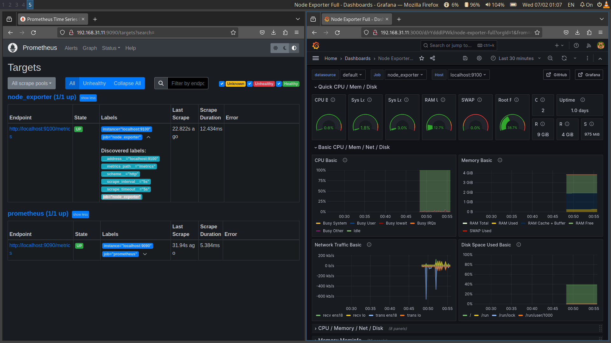

# Задание
1. Настройте мониторинг системы с использованием Prometheus, node_exporter.
2. Настройте дашборд в Grafana для визуализации данных.

## Решение
Задача решена по аналогии с тем как делали в лекции и на семинаре. Код для развертывания в каталоге [ansible](https://github.com/dgeny/linux-troubleshooting/tree/main/seminar-8/ansible). Делал специально без ролей, пошагово.

скриншот с места событий:

