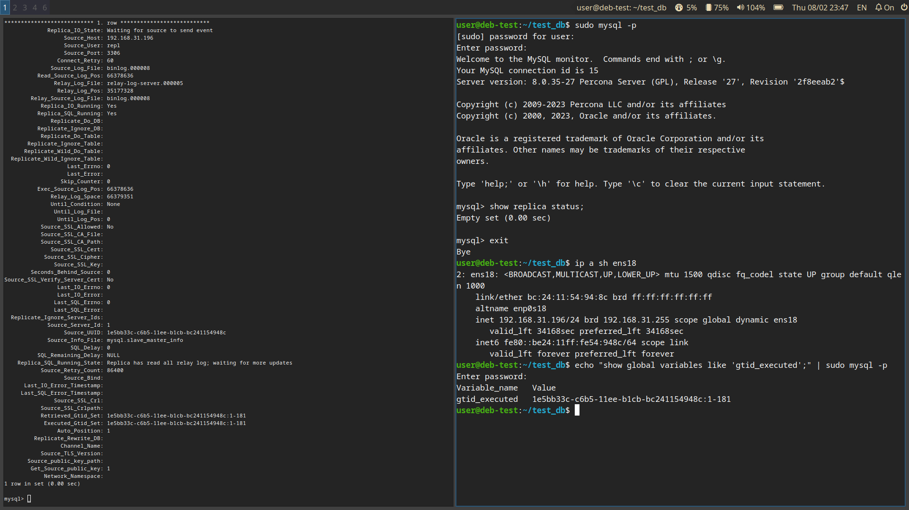
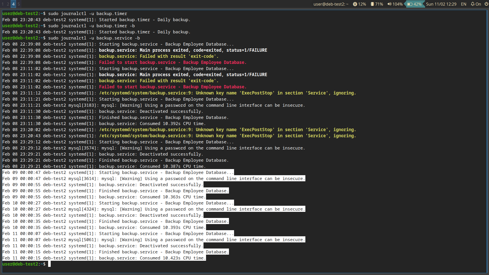
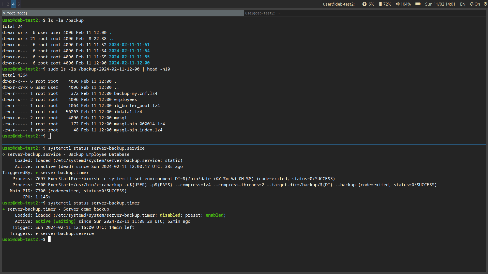

# Задания

## Задание 1. 

### Условие

Настройте схему репликации на основе GTID для сервера MySQL 8.0 или Percona Server for MySQL 8.0.

### Решение

Настройка проведена аналогично лекции и семинару. На мастер сервер импортирована тестовая БД https://github.com/datacharmer/test_db. На скриншоте проведенной репликации идентификаторы транзакций совпадают:



## Задание 2. 

### Условие 

Автоматизируйте бэкапы нужных баз данных в потабличном формате.

### Решение

Для автоматизации резервных копий создадим SystemD службу. Непосредственно создавать копию будем утилитой mydumper. На время резервирования репликация должна быть остановлена. 

```ini
[Unit]
Description=Backup Employee Database
After=network.target

[Service]
Environment=USER=root PASS=password
ExecStartPre=mysql -u${USER} -p${PASS} -e 'stop replica;'
ExecStart=/usr/bin/mydumper --user=root -p password -B employees -t 4 --triggers --events --routines --compress -o /backup_mydumper
ExecStopPost=mysql -u${USER} -p${PASS} -e 'start replica;'
Type=oneshot
```


Для автозапуска средствами SystemD создадим файл таймера. Запуск будет проводиться ежедневно в 00:00:

```ini
# /etc/systemd/system/backup.timer
[Unit]
Description=Daily backup

[Timer]
OnCalendar=daily
AccuracySec=12h
Persistent=true

[Install]
WantedBy=timers.target
```

Лог исполнения:



## Задание 3. 

### Условие 

Автоматизируйте физический бекап с помощью Percona XtraBackup.

### Решение

`sudo xtrabackup --user=root -p --backup --compress=lz4 --compress-threads=2 --target-dir=/backup`
Percona XtraBackup проведена аналогично лекции и семинару.  
Для автоматизации физического бэкапа создан SystemD сервис

```ini
[Unit]
Description=Backup Employee Database
After=network.target

[Service]
Environment=USER=root PASS=password 
ExecStartPre=/bin/sh -c 'systemctl set-environment DT=$(/bin/date +%%Y-%%m-%%d-%%H-%%M)'
ExecStart=/usr/bin/xtrabackup -u${USER} -p${PASS} --compress=lz4 --compress-threads=2 --target-dir=/backup/${DT} --backup
Type=oneshot
```

Для резервирования по расписанию создан SystemD таймер. Для _демострационных_ целей запуск настроен 1 раз в 15 минут:

```ini
[Unit]
Description=Server demo backup

[Timer]
OnCalendar=daily
AccuracySec=12h
Persistent=true

[Install]
WantedBy=timers.target
```

Лог исполнения (кратко, т.к. stdout перезатирает итерации, так понагляднее будет):


